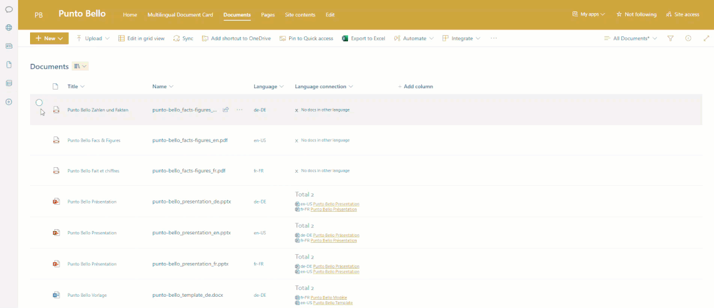

# PuntoBello Multilingual Document Field Customizer

## Summary
This field customizer is designed to be used in a document library to render connected documents (linked language variations).

### _Notes_
* The fields `pb_LangConn`, `pb_LangCd`, and the `clientSideComponentId` must be present and correctly configured.
* This solution depends on [PuntoBello multilingual listview](../puntobello-multilingualdocument-listview/)
* Uses [PnP JS](https://pnp.github.io/pnpjs/) library for all interactions with SharePoint.

### Features
The field customizer is applied to the `pb_LangConn` field. This field stores a GUID that represents the relationship between linked documents in different language variations.

#### Field pb_LangConn = Empty
If the `pb_LangConn` field is empty, the customizer renders a default message stating that there are no connected documents."

#### Field pb_LangConn = GUID
If the `pb_LangConn` field contains a GUID, it retrieves all documents with the same GUID in the same document library and renders the following information for each linked document:
- File type as an icon
- Locale from the field `pb_LangCd`
- Document title as a clickable hyperlink

### Parameters
You can configure all the parameters in the corresponding files located in the `env` directory. Once set, build the solution accordingly.

| Parameter                              | Description                                                              |
|----------------------------------------|--------------------------------------------------------------------------|
| SPFX_COLOR_PRIMARY                     | The primary color used across the application.                           |
| SPFX_COLOR_PRIMARY_BRIGHTNESS_DARK     | Adjusts the brightness of the primary color to a darker shade. The value should be less than 1; the lower the value, the darker the color.          |
| SPFX_BORDER_RADIUS                     | Radius for rounding the corners of elements.                             |
| SPFX_FONT_FAMILY                       | The font family used throughout the application.                         |
| SPFX_FONT_SIZE_GENERIC                 | Generic font size used for standard text elements.                       |
| SPFX_FONT_SIZE_TITLE                   | Font size used specifically for titles and headings.                     |

## Used SharePoint Framework Version 

 

## Solution

Solution|Author(s)
--------|---------
puntobello-multilingualdocument-field | Nello D'Andrea, die Mobiliar

## Version history

Version|Date|Comments
-------|----|--------
0.15.0   | July 2025 | Upgraded with Pantoum SPFx AI Upgrader
1.0.0|September 2024|Initial release

## License
[MIT License](../LICENSE.md)

## Acknowledgment Request

If you find this software useful and incorporate it into your own projects, especially for commercial purposes, we kindly ask that you acknowledge its use. This acknowledgment can be as simple as mentioning "Powered by Die Mobiliar - PuntoBello" in your product's documentation, website, or any related materials.

While this is not a requirement of the MIT License and is entirely voluntary, it helps support and recognize the efforts of the developers who contributed to this project. We appreciate your support!