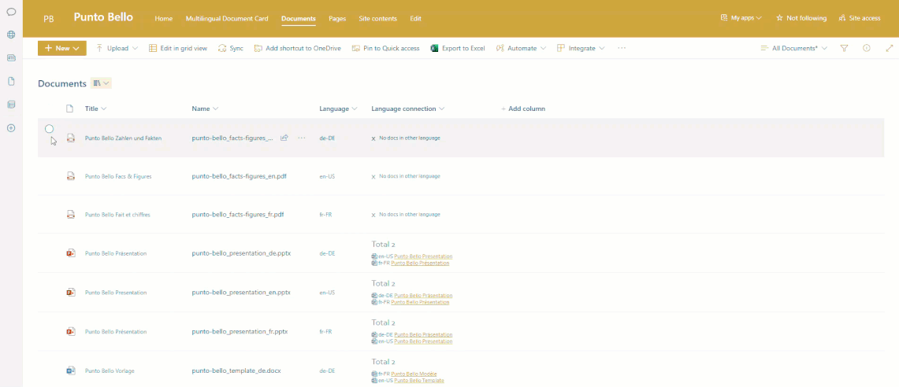

# PuntoBello Multilingual Listview Command Set

## Summary
This ListView Command set is designed to be used in a document library to manage the creation or deletion of language connections between documents.

### _Notes_
* The fields `pb_LangConn`, `pb_LangCd` must be present and the listview command set must be enabled in your document library
* This solution depends on [PuntoBello multilingual field customizer](../puntobello-multilingualdocument-field/) to render the connections correctly
* Uses [PnP JS](https://pnp.github.io/pnpjs/) library for all interactions with SharePoint.

### Features
With this ListView Command Set, you can :
- Set the language connection between two or more documents or add another document to a set of linked documents
- Remove the language connection of a specific document that has been already linked

_Note_: All linked documents must be of the same file type.

The command set performs various checks to ensure that a language connection or removal is allowed:
- Verifies if the documents are of the same file type.
- Checks if you are trying to link documents with the same language code (e.g., two English documents).
- Checks if you are trying to add a document for a language code that already exists in this specific set.

### Parameters
You can configure all the parameters in the corresponding files located in the `env` directory. Once set, build the solution accordingly.

| Parameter              | Description                                                              |
|------------------------|--------------------------------------------------------------------------|
| SPFX_COLOR_PRIMARY     | The primary color used throughout the application.                       |
| SPFX_BORDER_RADIUS     | Radius for rounding the corners of elements.                             |
| SPFX_FONT_FAMILY       | The font family used across the application.                             |
| SPFX_FONT_SIZE_GENERIC | The standard font size used for general text.                            |
| SPFX_FONT_SIZE_TITLE   | The font size used specifically for titles and headings.                 |

## Used SharePoint Framework Version 

 

## Solution

Solution|Author(s)
--------|---------
puntobello-multilingualdocument-listview | Nello D'Andrea, die Mobiliar

## Version history

Version|Date|Comments
-------|----|--------
1.1.0   | July 2025 | Upgraded with Pantoum SPFx AI Upgrader
1.0.0|September 2024|Initial release

## License
[MIT License](../LICENSE.md)

## Acknowledgment Request

If you find this software useful and incorporate it into your own projects, especially for commercial purposes, we kindly ask that you acknowledge its use. This acknowledgment can be as simple as mentioning "Powered by Die Mobiliar - PuntoBello" in your product's documentation, website, or any related materials.

While this is not a requirement of the MIT License and is entirely voluntary, it helps support and recognize the efforts of the developers who contributed to this project. We appreciate your support!

## Minimal Path to Awesome
Add documentation  / Mättu

